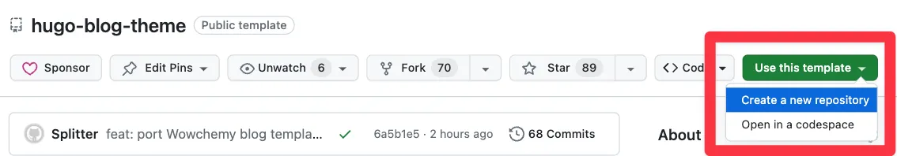
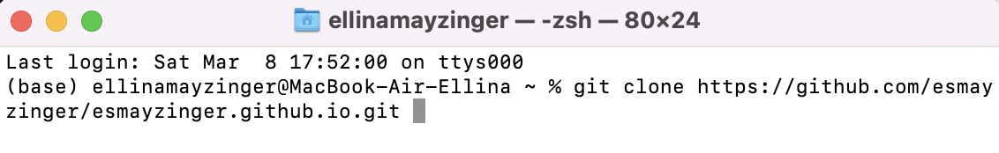
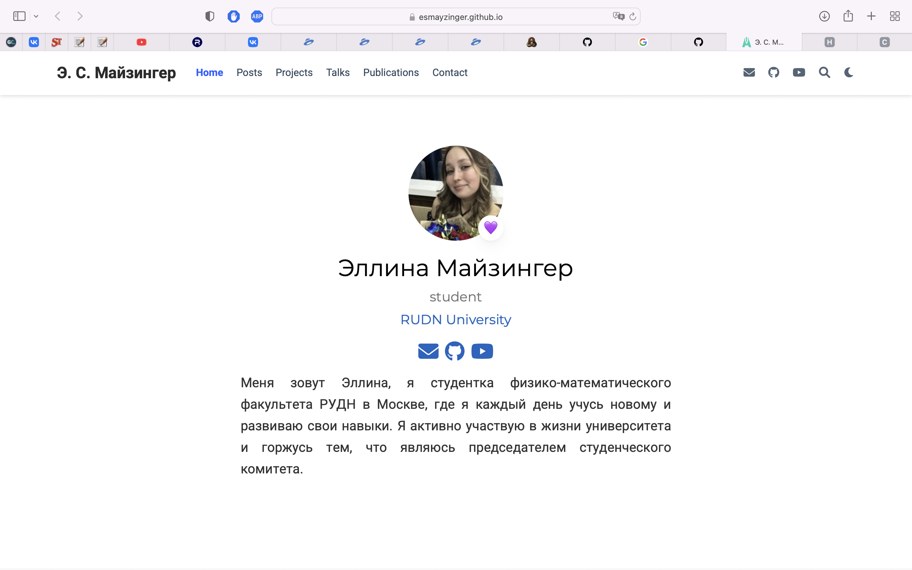

---
## Front matter
title: "Создание и развертывание персонального сайта с многоязычной поддержкой на GitHub Pages "
subtitle: "Разработка и деплой персонального сайта на GitHub Pages с
поддержкой многоязычности"
author: "Майзингер Эллина Сергеевна"

## Generic otions
lang: ru-RU
toc-title: "Содержание"

## Bibliography
bibliography: bib/cite.bib
csl: pandoc/csl/gost-r-7-0-5-2008-numeric.csl

## Pdf output format
toc: true # Table of contents
toc-depth: 2
lof: true # List of figures
lot: true # List of tables
fontsize: 12pt
linestretch: 1.5
papersize: a4
documentclass: scrreprt
## I18n polyglossia
polyglossia-lang:
  name: russian
  options:
	- spelling=modern
	- babelshorthands=true
polyglossia-otherlangs:
  name: english
## I18n babel
babel-lang: russian
babel-otherlangs: english
## Fonts
mainfont: PT Serif
romanfont: PT Serif
sansfont: PT Sans
monofont: PT Mono
mainfontoptions: Ligatures=TeX
romanfontoptions: Ligatures=TeX
sansfontoptions: Ligatures=TeX,Scale=MatchLowercase
monofontoptions: Scale=MatchLowercase,Scale=0.9
## Biblatex
biblatex: true
biblio-style: "gost-numeric"
biblatexoptions:
  - parentracker=true
  - backend=biber
  - hyperref=auto
  - language=auto
  - autolang=other*
  - citestyle=gost-numeric
## Pandoc-crossref LaTeX customization
figureTitle: "Рис."
tableTitle: "Таблица"
listingTitle: "Листинг"
lofTitle: "Список иллюстраций"
lotTitle: "Список таблиц"
lolTitle: "Листинги"
## Misc options
indent: true
header-includes:
  - \usepackage{indentfirst}
  - \usepackage{float} # keep figures where there are in the text
  - \floatplacement{figure}{H} # keep figures where there are in the text
---

# Цель работы

В рамках данной работы предполагается разработка и запуск личного веб-сайта на базе GitHub Pages. Сайт будет спроектирован как интерактивное портфолио, предназначенное для демонстрации информации об авторе и публикации различного контента. Для обеспечения широкой доступности информации, сайт будет обладать двуязычной поддержкой, позволяющей пользователям переключаться между двумя языковыми версиями. Для реализации этой цели будет реализован удобный механизм переключения между языками. Важным аспектом является независимая локализация интерфейса и контента, что позволит поддерживать актуальность и достоверность информации на обоих языках.

# Задание

## Основная задача

Разработать и развернуть персональный сайт на платформе GitHub Pages, удовлетворяющий следующим требованиям:

## Функциональные требования

Представление информации об авторе: Сайт должен содержать разделы с информацией об образовании, опыте работы, навыках, проектах и других релевантных деталях, позволяющих сформировать полное представление об авторе.
Публикация контента: Предусмотреть возможность публикации статей, записей в блоге, новостей и других материалов, представляющих интерес для автора и целевой аудитории.
Многоязычность: Реализовать поддержку двух языков (например, русского и английского) с возможностью удобного переключения между ними.
Интерактивность: Сайт должен быть интерактивным, предусматривая возможность взаимодействия с пользователями, например, через форму обратной связи или систему комментариев (опционально).

## Технические требования

Развертывание на GitHub Pages: Сайт должен быть размещен и функционировать на платформе GitHub Pages.
Поддержка независимого перевода: Реализовать систему управления контентом, позволяющую независимо переводить элементы интерфейса и текстовое наполнение сайта на разные языки.
Адаптивный дизайн: Сайт должен корректно отображаться на различных устройствах (компьютеры, планшеты, смартфоны) с различными разрешениями экрана.

# Теоретическое введение

В современной веб-разработке автоматизация играет ключевую роль в ускорении процессов и повышении эффективности. GitHub, как ведущая платформа для хостинга и совместной разработки проектов, предоставляет мощные инструменты для автоматизации деплоя и хостинга веб-сайтов: GitHub Pages и GitHub Actions.

## GitHub Pages

GitHub Pages – это бесплатный сервис хостинга статических веб-сайтов, предлагаемый GitHub. Он позволяет пользователям размещать веб-сайты непосредственно из репозиториев GitHub, делая процесс деплоя максимально простым и доступным.

Основные характеристики GitHub Pages:
Хостинг статических сайтов: GitHub Pages предназначен для хостинга статических сайтов, состоящих из HTML, CSS, JavaScript, изображений и других статических ресурсов. Он не поддерживает серверный код, такой как PHP или Python.
Интеграция с GitHub: GitHub Pages тесно интегрирован с GitHub, что позволяет автоматически публиковать сайт при каждом изменении в репозитории.
Простота использования: Развертывание сайта на GitHub Pages не требует специальных знаний или инструментов. Достаточно загрузить статические файлы в репозиторий и настроить GitHub Pages.
Бесплатность: GitHub Pages предоставляется бесплатно для личных и организационных проектов.
Поддержка пользовательских доменов: GitHub Pages позволяет использовать собственные доменные имена для веб-сайтов.
Поддержка HTTPS: GitHub Pages автоматически обеспечивает шифрование HTTPS для всех сайтов.

## GitHub Actions

GitHub Actions – это платформа для автоматизации, интегрированная непосредственно в GitHub. Она позволяет автоматизировать различные задачи в процессе разработки, такие как сборка, тестирование, деплой и многое другое.

Основные характеристики GitHub Actions:

Автоматизация рабочих процессов: GitHub Actions позволяет создавать автоматизированные рабочие процессы (workflows), которые выполняются в ответ на определенные события в репозитории, такие как push, pull request, создание issue и т.д.
Основана на YAML: Рабочие процессы описываются с помощью файлов YAML, что делает их легко читаемыми и редактируемыми.
Широкий спектр возможностей: GitHub Actions позволяет автоматизировать практически любые задачи, связанные с разработкой и деплоем.
Большое количество готовых actions: GitHub Marketplace предлагает множество готовых actions, которые можно использовать в своих рабочих процессах.
Кроссплатформенность: GitHub Actions поддерживает выполнение задач на различных операционных системах (Linux, Windows, macOS).
Интеграция с GitHub: GitHub Actions тесно интегрирован с GitHub, что позволяет легко получать доступ к репозиторию, переменным окружения и другим ресурсам.

## GitHub Pages и GitHub Actions: Совместное использование

GitHub Actions может быть использован для автоматизации процесса деплоя статических сайтов на GitHub Pages. Например, можно настроить рабочий процесс, который будет автоматически собирать сайт из исходного кода (например, с использованием статических генераторов сайтов, таких как Jekyll или Hugo), а затем развертывать его на GitHub Pages при каждом push в определенную ветку репозитория.

Преимущества совместного использования GitHub Pages и GitHub Actions:

Автоматизация деплоя: Автоматический деплой сайта при каждом изменении в репозитории.
Улучшение процесса разработки: Автоматизация задач сборки и тестирования позволяет сосредоточиться на разработке, а не на рутинных операциях.
Повышение эффективности: Автоматизация сокращает время, необходимое для развертывания изменений на сайте.
Уменьшение количества ошибок: Автоматизированные рабочие процессы снижают вероятность человеческих ошибок при деплое.

# Выполнение работы

## Создаем репозиторий на основе шаблона HugoBlox

Мы идем на страницу шаблона: https://github.com/HugoBlox/theme-blog.

{ #fig:008 width=70% }

Мы создаем новый репозиторий, используя шаблон, нажав кнопку "Use this template".
Мы даем репозиторию имя (например, your-username.github.io).

{ #fig:008 width=70% }

## Клонируем репозиторий

Теперь мы клонируем репозиторий на свой компьютер, чтобы редактировать его локально. Мы используем команду git clone https://github.com/esmayzinger/esmayzinger.github.io.git

{ #fig:008 width=70% }

## Настраиваем многоязычность

Мы открываем репозиторий в IDE (VS Code, PyCharm и т. д.).
В папке content мы находим папку en (английский контент).
Мы копируем папку en и вставляем её в content.
Мы переименовываем скопированную папку в ru (русский контент).
В папке ru мы редактируем файл _index.md, переводя информацию об авторе на русский. Мы добавляем аватар и личную информацию.

## Добавляем контент (посты)

В папке content мы видим папку blog с предустановленными постами.
Мы редактируем файл en/blog/_index.md, чтобы настроить заголовок страницы блога.
Мы создаем новые Markdown-файлы в папках en/blog и ru/blog для новых постов на английском и русском языках, соответственно. Мы редактируем шаблон index.md и добавляем пробный пост.

## Настраиваем меню
Мы копируем файл menus.en.yaml в menus.ru.yaml.
 Мы редактируем menus.ru.yaml, раскомментируя строки для русского языка и переводя пункты меню.

## Фиксируем и отправляем изменения

Мы сохраняем все наши изменения.
Мы коммитим изменения (git add ., git commit -m "Add multilingual support and content").
Мы отправляем изменения на GitHub (git push origin main).

##Ждем деплоя
Мы идем на страницу https://github.com/esmayzinger/esmayzinger.github.io.git/actions и ждем, пока сайт задеплоится.

##  Проверяем результат:
После успешного деплоя мы открываем сайт по адресу https://esmayzinger.github.io/ .
Мы проверяем, что сайт работает, многоязычность настроена, и контент отображается корректно.

{ #fig:008 width=70% }

# Выводы

В результате проделанной работы был успешно модифицирован контент веб-страницы, размещенной на платформе GitHub Pages. Процесс включал в себя внесение изменений в существующие текстовые и медиа-материалы, а также, возможно, добавление новых элементов для улучшения представления информации. После завершения этапа редактирования был осуществлен деплой веб-страницы, что позволило опубликовать обновленную версию контента и сделать ее доступной для просмотра в сети Интернет. 

# Список литературы{.unnumbered}

esystem rudn 

https://github.com/yamadharma

Кристина Александровна Штепа
