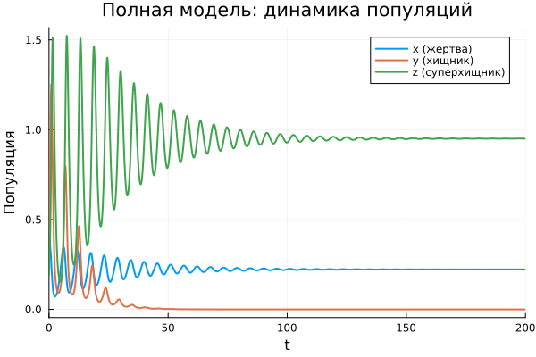
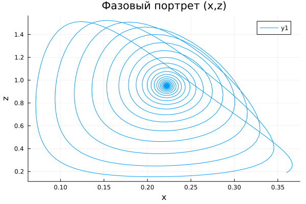
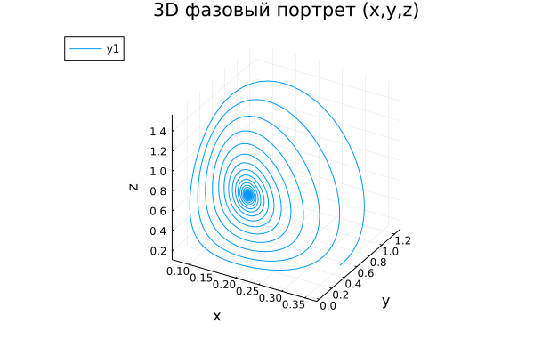
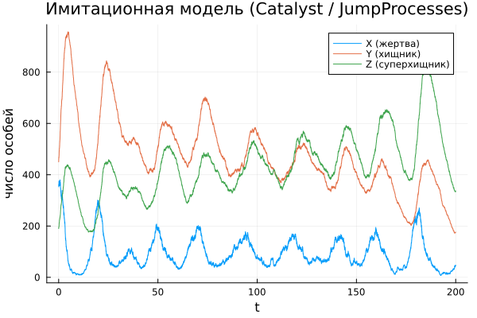
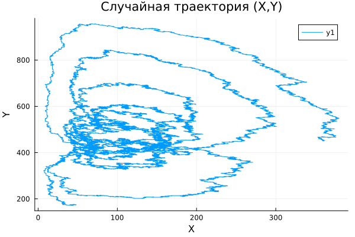
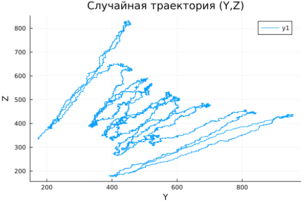

---
## Front matter
title: "Трехпопуляционные системы. Модель «хищник-жертва-суперхищник"
subtitle: "Практика"
author: "Майзингер Эллина Сергеевна"

## Generic options
lang: ru-RU
toc-title: "Содержание"

## Pdf output format
toc: true
toc-depth: 2
lof: true
lot: true
fontsize: 12pt
linestretch: 1.5
papersize: a4
documentclass: scrreprt

## I18n polyglossia
polyglossia-lang:
  name: russian
  options:
    - spelling=modern
    - babelshorthands=true

## Fonts
mainfont: PT Serif
romanfont: PT Serif
sansfont: PT Sans
monofont: PT Mono
mainfontoptions: Ligatures=TeX
romanfontoptions: Ligatures=TeX
sansfontoptions: Ligatures=TeX,Scale=MatchLowercase
monofontoptions: Scale=MatchLowercase,Scale=0.9

## Misc options
indent: true
header-includes:
  - \usepackage{indentfirst}
  - \usepackage{float}
  - \floatplacement{figure}{H}
---

# Введение
Трёхзвенная трофическая цепь «жертва — хищник — суперхищник» является естественным расширением классической модели Лотки–Вольтерры. В отличие от двухпопуляционного взаимодействия «жертва—хищник», такая система позволяет учитывать влияние более высокого трофического уровня.  

Обозначим:
- `x(t)` — численность жертв,
- `y(t)` — численность хищников,
- `z(t)` — численность суперхищников.

Система интересна набором возможных динамик:
- вымирание хищника или суперхищника,
- стабильное сосуществование трёх видов,
- колебательные режимы,
- **семейство равновесий** (не одно стационарное состояние, а целое множество) при определённых параметрах.


# Математическая модель

## Полная модель (Holling II + Beddington–DeAngelis)

$$
\begin{aligned}
\frac{dx}{dt} &= x(1-x) - \frac{xy}{1+b_1 x} - \frac{xz}{1+b_1 x},\\
\frac{dy}{dt} &= \frac{\eta_1 x y}{1+b_1 x} - \frac{d_1 y z}{1 + b_2 y + b_3 z} - \mu_1 y,\\
\frac{dz}{dt} &= \frac{\eta_2 x z}{1+b_1 x} + \frac{d_2 y z}{1 + b_2 y + b_3 z} - \mu_2 z.
\end{aligned}
$$

# Равновесия и косимметрия

Тривиальные равновесия:
- \(E_0 = (0,0,0)\) — исчезновение всех популяций
- \(E_1 = (1,0,0)\) — вымирание хищников и суперхищников
Если $\mu_1 < \eta_1$ появляется равновесие двух видов:

$$
E_2 = \left(\frac{\mu_1}{\eta_1},\ 1 - \frac{\mu_1}{\eta_1},\ 0 \right).
$$

Если $\mu_2 < \eta_2$:

$$
E_3 = \left(\frac{\mu_2}{\eta_2},\ 0,\ 1 - \frac{\mu_2}{\eta_2} \right).
$$

## Косимметрия и семейство равновесий
При условиях:

$$
\mu_2 = d_2\left(1+\frac{\mu_1}{d_1}\right), \qquad
\eta_2 = d_2\left(1+\frac{\eta_1}{d_1}\right)
$$

упрощённая система обладает **косимметрией**: возникает не одно равновесие, а *континуальное семейство*.  
Это означает, что бесконечно много стационарных состояний лежат на одной прямой.  
Численные эксперименты показывают: траектории очень медленно движутся вдоль неё.

Если параметры нарушить — семейство исчезает, и система выбирает одно из состояний:
- вымирание хищника,
- или вымирание суперхищника.


# Численное моделирование в Julia

## Установка библиотек
```julia
using Pkg
Pkg.add(["DifferentialEquations", "Plots", "LaTeXStrings", "Catalyst"])
```


## Полная модель (непрерывная)

```julia
using DifferentialEquations
using Plots

# Параметры
b1 = 1.0
b2 = 0.0
b3 = 0.0
eta1 = 10.0
eta2 = 11.0
d1 = 1.0
d2 = 1.0
mu1 = 1.0
mu2 = 2.0

# Начальные условия
u0 = [0.36, 0.45, 0.19]
tspan = (0.0, 200.0)

function full_model!(du, u, p, t)
    x, y, z = u
    du[1] = x*(1 - x) - x*y/(1 + b1*x) - x*z/(1 + b1*x)
    du[2] = eta1*x*y/(1 + b1*x) - d1*y*z/(1 + b2*y + b3*z) - mu1*y
    du[3] = eta2*x*z/(1 + b1*x) + d2*y*z/(1 + b2*y + b3*z) - mu2*z
end

prob = ODEProblem(full_model!, u0, tspan)

sol = solve(prob, Rodas5(), reltol=1e-8, abstol=1e-8)

# График
plot(sol, xlabel="t", ylabel="Популяция",
     label=["x (жертва)" "y (хищник)" "z (суперхищник)"],
     title="Полная модель: динамика популяций",
     linewidth=2)
savefig("full_model_plot.png")
```
- 


## Фазовые траектории

```julia
# (y,z)
plot([u[2] for u in sol.u], [u[3] for u in sol.u],
     xlabel="y", ylabel="z", title="Фазовый портрет (y,z)")
savefig("phase_yz.png")

# (x,y)
plot([u[1] for u in sol.u], [u[2] for u in sol.u],
     xlabel="x", ylabel="y", title="Фазовый портрет (x,y)")
savefig("phase_xy.png")

# (x,z)
plot([u[1] for u in sol.u], [u[3] for u in sol.u],
     xlabel="x", ylabel="z", title="Фазовый портрет (x,z)")
savefig("phase_xz.png")

# 3D фазовый портрет
plot([u[1] for u in sol.u], [u[2] for u in sol.u], [u[3] for u in sol.u],
     xlabel="x", ylabel="y", zlabel="z", title="3D фазовый портрет (x,y,z)")
savefig("phase_xyz.png")
```

- 

- 

- 

- 


# Имитационное моделирование (дискретное)

```julia
using Pkg
Pkg.add(["Catalyst", "JumpProcesses", "DifferentialEquations", "Plots"])

using Catalyst, JumpProcesses, DifferentialEquations, Plots

# Используем латинские символы вместо греческих
@parameters a b g r1 r2
@variables t
@species X(t) Y(t) Z(t)

rn = @reaction_network begin
    a,  X --> X + X         # рождаемость жертвы
    b,  X + X --> X         # конкуренция
    r1, X + Y --> Y + Y     # хищничество Y
    r2, X + Z --> Z + Z     # хищничество Z
    g,  Y --> 0             # смертность Y
    g,  Z --> 0             # смертность Z
end

u0 = [X => 360, Y => 450, Z => 190]
p = [a => 1.0, b => 1e-3, r1 => 1e-3, r2 => 1.1e-3, g => 0.1]
tspan = (0.0, 200.0)

dprob = DiscreteProblem(rn, u0, tspan, p)
jprob = JumpProblem(rn, dprob, Direct())
solj = solve(jprob, SSAStepper())

plot(solj.t, hcat(solj[X], solj[Y], solj[Z]),
     xlabel="t", ylabel="число особей",
     label=["X (жертва)" "Y (хищник)" "Z (суперхищник)"],
     title="Имитационная модель (Catalyst / JumpProcesses)")
savefig("stochastic_catalyst.png")

# Фазовые проекции
plot(solj[X], solj[Y], xlabel="X", ylabel="Y", title="Случайная траектория (X,Y)")
savefig("stoch_phase_XY.png")
plot(solj[Y], solj[Z], xlabel="Y", ylabel="Z", title="Случайная траектория (Y,Z)")
savefig("stoch_phase_YZ.png")
```
- 

- 

- 

