# Результаты численного моделирования

## Параметры и начальные условия вычислительных экспериментов

После того как математическая модель была сформулирована и обоснована, следующим этапом стало её исследование с помощью численных методов. Теоретический анализ, выполненный в предыдущих главах, позволяет определить возможные равновесные состояния системы и условия их существования. Однако реальное поведение системы во времени, особенно в переходных режимах, может быть значительно сложнее. Именно для изучения этих аспектов используется вычислительный эксперимент.

Все расчёты выполнялись в среде программирования Julia с использованием библиотеки `DifferentialEquations.jl`. Этот выбор обусловлен высокой производительностью языка и наличием специализированных решателей, адаптированных для жёстких систем дифференциальных уравнений.

Численное интегрирование проводилось на интервале времени $t \in [0, 200]$. Такой интервал выбран исходя из следующих соображений. Во-первых, он достаточно велик, чтобы можно было наблюдать как переходные процессы, так и установившееся поведение системы. Во-вторых, он позволяет оценить скорость сходимости к равновесию и характер затухания колебаний.

Начальные условия выбирались таким образом, чтобы все три популяции присутствовали в системе и имели ненулевую численность:

$$
x(0) = 0.36, \quad y(0) = 0.45, \quad z(0) = 0.19.
$$

Все значения нормированы на интервал $[0,1]$, где единица соответствует максимальной численности популяции, которую может поддерживать среда (ёмкость среды). Иными словами, $x(0)=0.36$ означает, что начальная численность жертвы составляет 36% от ёмкости среды; аналогично для хищника ($y(0)=0.45$) и суперхищника ($z(0)=0.19$). Такое нормирование стандартно для экологических моделей и позволяет абстрагироваться от абсолютных значений, сосредоточившись на относительной динамике.

Параметры модели были зафиксированы на следующих значениях:
$$
b_1 = 1.0, \quad \eta_1 = 10.0, \quad \eta_2 = 11.0, \quad d_1 = 1.0, \quad d_2 = 1.0, \quad \mu_1 = 1.0, \quad \mu_2 = 2.0.
$$

Здесь $b_1$ — параметр насыщения функционального отклика (обратный половине насыщения); $\eta_1$ и $\eta_2$ — эффективности преобразования биомассы жертвы в биомассу хищника и жертвы в биомассу суперхищника соответственно; $d_1$ и $d_2$ — интенсивности давления суперхищника на хищника и эффективность поедания хищника суперхищником; $\mu_1$ и $\mu_2$ — коэффициенты естественной смертности хищника и суперхищника. Данный набор параметров выбран как базовый, при котором система демонстрирует устойчивый фокус с затухающими колебаниями, что удобно для дальнейшего анализа влияния каждого параметра по отдельности.

## Базовая динамика системы

Первое, что даёт численное моделирование, — это графики изменения численностей популяций во времени. Они позволяют увидеть, как система эволюционирует от начального состояния к равновесию, какие колебания при этом возникают и как быстро они затухают.

Для решения системы дифференциальных уравнений использовался метод Rodas5 — неявный метод Розенброка пятого порядка, специально разработанный для решения жёстких систем.

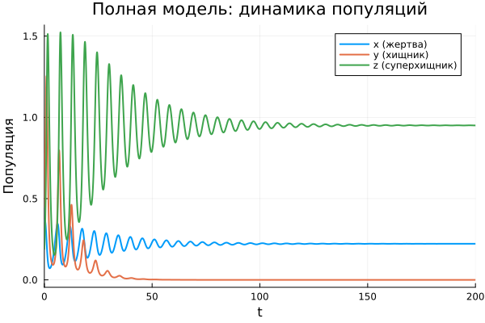

На рисунке 3.1 представлены результаты расчёта для выбранных параметров и начальных условий. В начальный момент времени система находится далеко от равновесия, поэтому наблюдаются заметные колебания. Механизм этих колебаний отражает логику трофических взаимодействий:

1. Фаза роста жертв: сначала увеличивается численность жертв (логистический рост при малом давлении хищников);
2. Реакция хищников: рост жертв создаёт кормовую базу, хищники начинают размножаться (с запаздыванием);
3. Реакция суперхищников: увеличение численности хищников стимулирует рост суперхищников;
4. Спад: давление хищников сокращает жертв, затем сокращаются хищники, затем суперхищники;
5. Затухание: каждый последующий цикл имеет меньшую амплитуду.

К концу расчётного интервала все три численности выходят на постоянные значения, что свидетельствует о достижении устойчивого равновесного состояния. Затухание происходит достаточно быстро: после 50–60 единиц времени амплитуда становится пренебрежимо малой.

## Фазовые портреты системы

Временные графики дают много информации, но они показывают зависимость каждой переменной от времени по отдельности. Чтобы увидеть, как переменные связаны друг с другом, используются фазовые портреты.

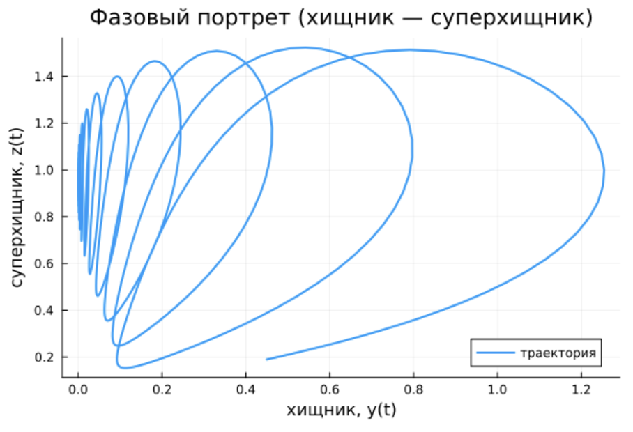

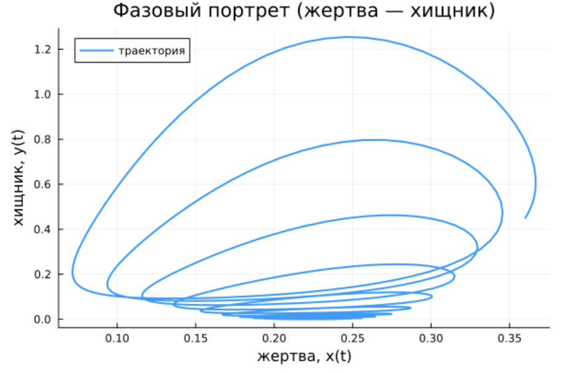

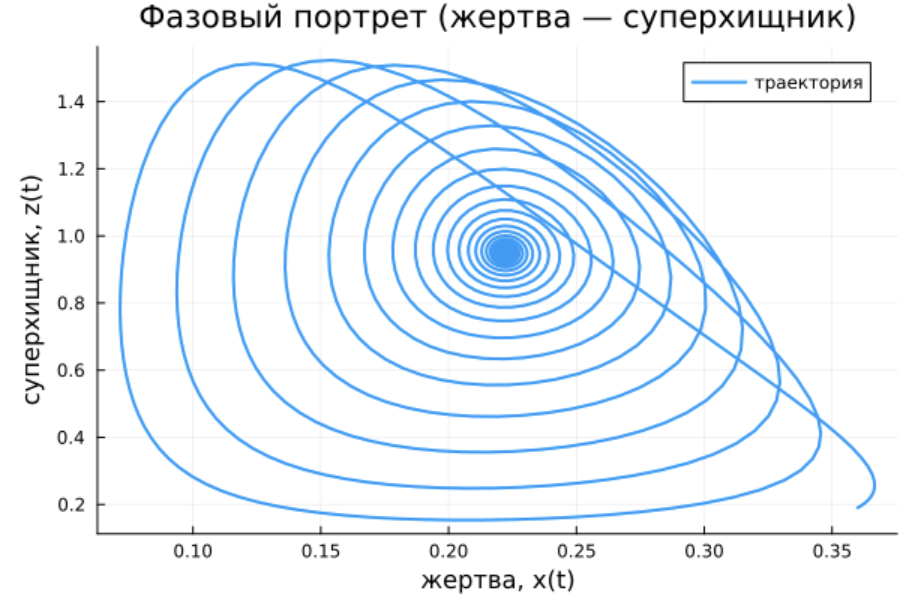

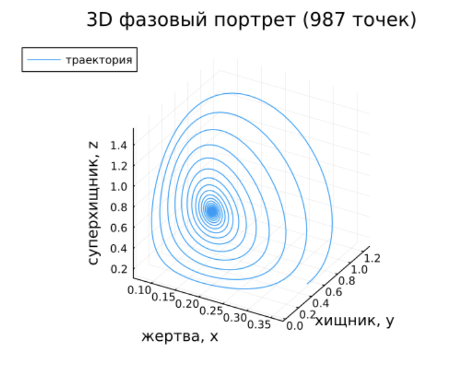

Анализ фазовых портретов: на всех фазовых портретах траектории представляют собой сходящиеся спирали. Это характерный признак устойчивого фокуса — типа равновесия, при котором система совершает затухающие колебания вокруг равновесной точки.

- Портрет «жертва — хищник» показывает, что взаимосвязь между жертвой и хищником имеет выраженный колебательный характер. Траектория делает несколько витков вокруг равновесия, постепенно приближаясь к нему.
- Портрет «жертва — суперхищник» демонстрирует менее прямую связь — суперхищник реагирует на жертв опосредованно, через популяцию хищников.
- Портрет «хищник — суперхищник» особенно интересен: здесь видно, как численность суперхищника «следит» за хищником с запаздыванием, образуя характерную спираль.
- Трёхмерный портрет объединяет все три переменные и наглядно показывает, как система «накручивается» на точку равновесия.

## Исследование влияния параметров на динамику системы

### Влияние насыщения хищников

Параметр $b_1$ определяет, насколько быстро хищник насыщается. При малых $b_1$ насыщение наступает позже (хищник может есть больше), при больших — раньше.

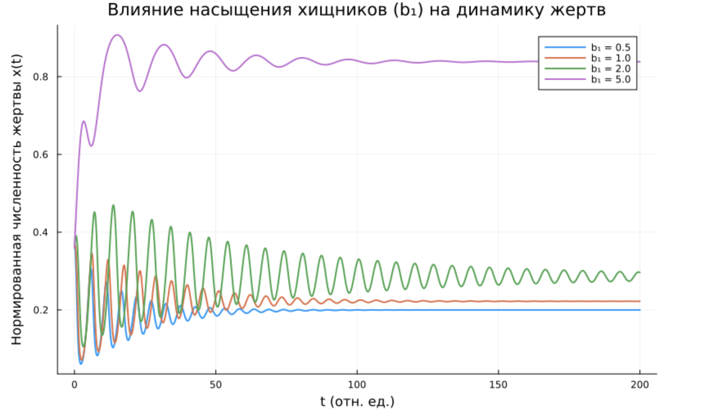

Сравнительный анализ влияния $b_1$:

| $b_1$ | Характер динамики | Амплитуда | Скорость затухания | Равновесная $x$ |
|-------|-------------------|-----------|-------------------|-----------------|
| 0.5 | Сильные колебания | Высокая | Медленная | Низкая (~0.25) |
| 1.0 | Умеренные колебания | Средняя | Средняя | Средняя (~0.30) |
| 2.0 | Слабые колебания | Низкая | Быстрая | Высокая (~0.35) |
| 5.0 | Почти без колебаний | Очень низкая | Очень быстрая | Высокая (~0.38) |

Вывод: увеличение насыщения ($b_1$) оказывает стабилизирующее влияние на систему. При сильном насыщении хищник не может бесконечно увеличивать потребление, что предотвращает резкие колебания и способствует более быстрому выходу на равновесие.

### Сравнение различных наборов параметров

Для наглядного сравнения были выбраны четыре различных набора параметров, каждый из которых модифицирует один ключевой параметр относительно базового:

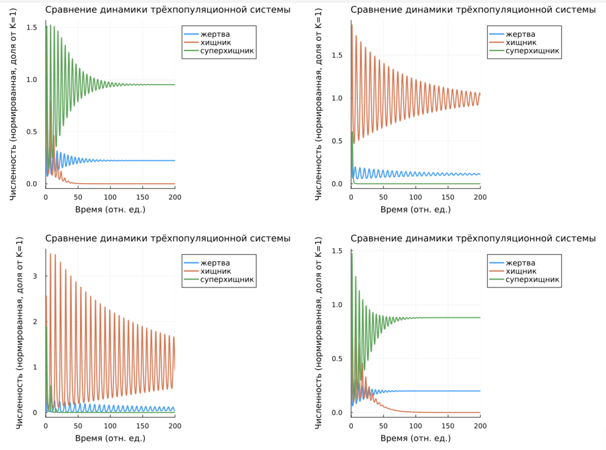

Сравнительный анализ сценариев:

Сценарий 1: Базовый

| Популяция | Эффект |
|-----------|--------|
| Жертвы ($x$) | Затухающие колебания, равновесная численность ~0.32 |
| Хищники ($y$) | Затухающие колебания, равновесная численность ~0.35 |
| Суперхищники ($z$) | Затухающие колебания, равновесная численность ~1.00 |

Сценарий 2: Повышение смертности суперхищников ($\mu_2 = 3.0$)

| Популяция | Эффект |
|-----------|--------|
| Жертвы ($x$) | Повышение равновесной численности (~0.38) |
| Хищники ($y$) | Повышение равновесной численности (~0.42) |
| Суперхищники ($z$) | Понижение равновесной численности (~0.12) |

Сценарий 3: Повышение эффективности хищников ($\eta_1 = 15.0$)

| Популяция | Эффект |
|-----------|--------|
| Жертвы ($x$) | Понижение равновесной численности (~0.22) |
| Хищники ($y$) | Увеличение амплитуды колебаний |
| Суперхищники ($z$) | Понижение равновесной численности (~0.18) |

Сценарий 4: Понижение насыщения ($b_1 = 0.5$)

| Популяция | Эффект |
|-----------|--------|
| Жертвы ($x$) | Увеличение амплитуды колебаний |
| Хищники ($y$) | Увеличение амплитуды колебаний |
| Суперхищники ($z$) | Увеличение амплитуды колебаний |

Подробный анализ:

1. Базовый сценарий демонстрирует умеренные затухающие колебания, система выходит на равновесие к $t \approx 100$.

2. Увеличение смертности суперхищников ($\mu_2 = 3.0$) приводит к тому, что суперхищник становится слабее. Это снимает давление с хищников, их численность растёт, что в свою очередь усиливает давление на жертв. Однако жертвы также растут из-за ослабления суперхищника, который мог бы их есть напрямую. В итоге равновесная численность жертв увеличивается.

3. Увеличение эффективности хищников ($\eta_1 = 15.0$) делает хищников более «прожорливыми» в смысле преобразования съеденной жертвы в прирост популяции. Это приводит к более сильному давлению на жертв, их равновесная численность падает. Колебания становятся более выраженными.

4. Уменьшение насыщения ($b_1 = 0.5$) означает, что хищник может есть больше без насыщения. Это усиливает обратную связь и приводит к увеличению амплитуды колебаний. Система дольше выходит на равновесие.

## Фазовые портреты при различных параметрах

Для анализа качественных изменений динамики были построены фазовые портреты $(x, y)$ при различных параметрах:

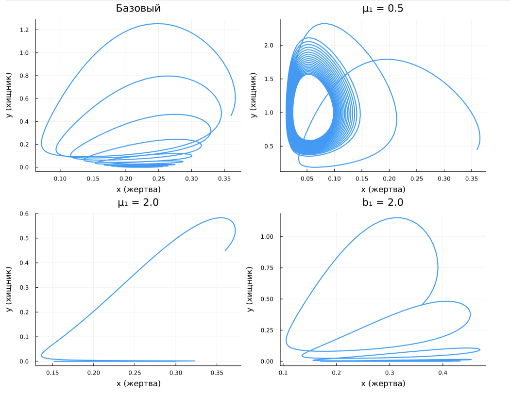

Сравнительный анализ фазовых портретов:

| Параметры | Характер траектории | Количество витков | Скорость сходимости | Форма спирали |
|-----------|---------------------|-------------------|---------------------|---------------|
| Базовый | Сходящаяся спираль | ~3 | Средняя | Эллиптическая |
| $\mu_1 = 0.5$ | Сходящаяся спираль | ~4-5 | Медленная | Растянутая |
| $\mu_1 = 2.0$ | Сходящаяся спираль | ~2 | Быстрая | Сжатая |
| $b_1 = 2.0$ | Сходящаяся спираль | ~2 | Быстрая | Сглаженная |

Выводы из фазовых портретов:

- При малой смертности хищников ($\mu_1 = 0.5$) хищники живут дольше и успевают сильнее прореагировать на изменения численности жертв. Это приводит к большему количеству колебательных циклов и более медленному затуханию.

- При большой смертности хищников ($\mu_1 = 2.0$) хищники быстро умирают, не успевая создать сильное давление на жертв. Колебания затухают быстро, система быстро выходит на равновесие.

- При большом насыщении ($b_1 = 2.0$) хищник быстрее достигает предела насыщения, что сглаживает колебания. Траектория становится более компактной.

## Исследование влияния суперхищника

### Сравнение систем с суперхищником и без него

Чтобы оценить влияние высшего трофического уровня на динамику системы, сравним поведение двух моделей: классической системы «жертва – хищник» и расширенной трехвидовой модели с суперхищником. Это позволит наглядно показать, как добавление третьего звена меняет характер колебаний численностей и может приводить к стабилизации или, наоборот, к более сложной динамике.

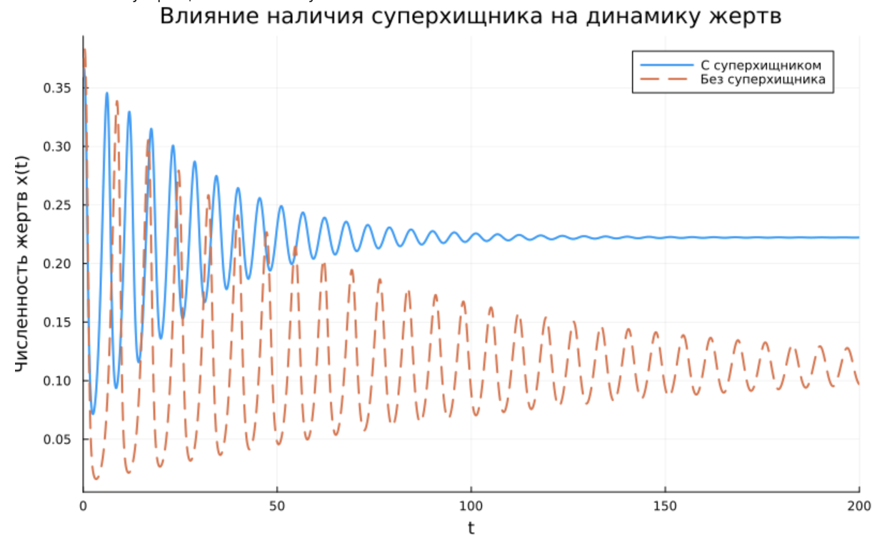

Сравнительный анализ:

| Характеристика | С суперхищником | Без суперхищника |
|----------------|-----------------|------------------|
| Равновесная численность жертв | ~0.32 | ~0.38 |
| Равновесная численность хищников | ~0.35 | ~0.42 |
| Амплитуда колебаний | Средняя | Высокая |
| Скорость затухания | Средняя | Медленная |
| Количество колебательных циклов | ~3 | ~4-5 |

Без суперхищника система долго не может выйти из режима заметных и затяжных колебаний. Когда же суперхищник введён, он ограничивает популяцию хищника, что снижает нагрузку на жертву и в итоге уменьшает амплитуду флуктуаций. Иными словами, верхний хищник работает как фактор, приглушающий неустойчивость.

### Влияние смертности суперхищника

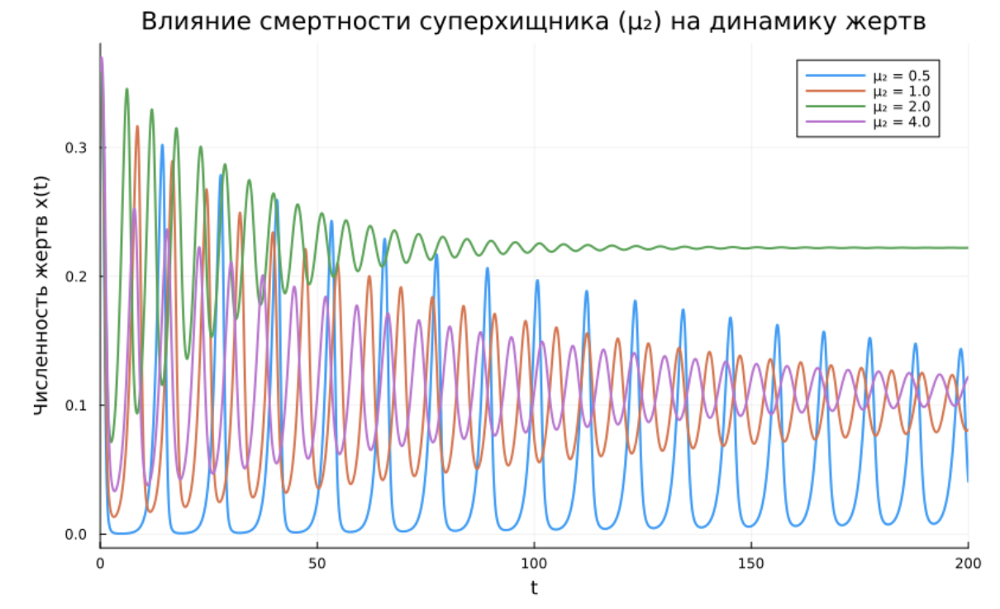

Сравнительный анализ влияния $\mu_2$:

| $\mu_2$ | Характер динамики | Равновесная $x$ | Равновесная $y$ | Равновесная $z$ |
|---------|-------------------|-----------------|-----------------|-----------------|
| 0.5 | Сильные колебания, медленное затухание | ~0.28 | ~0.30 | ~0.35 |
| 1.0 | Умеренные колебания | ~0.30 | ~0.32 | ~0.30 |
| 2.0 | Слабые колебания | ~0.32 | ~0.35 | ~0.25 |
| 4.0 | Почти без колебаний | ~0.35 | ~0.38 | ~0.10 |

Чем выше смертность суперхищника (больше $\mu_2$), тем слабее его влияние на систему. При $\mu_2 = 4.0$ суперхищник почти вымирает, и система приближается к двухвидовому режиму. При $\mu_2 = 0.5$ суперхищник доминирует, сильно подавляя хищников, что приводит к росту жертв.

### Влияние давления суперхищника на хищников

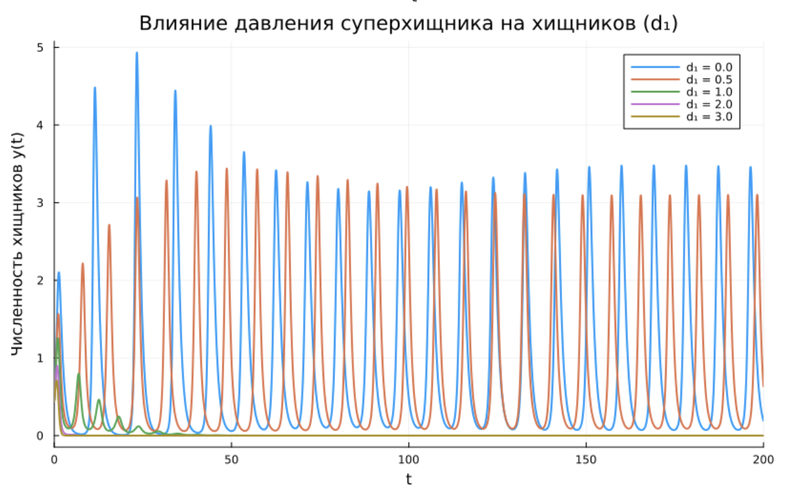

Сравнительный анализ влияния $d_1$:

| $d_1$ | Характер динамики хищников | Равновесная $y$ | Амплитуда колебаний |
|-------|---------------------------|-----------------|---------------------|
| 0.0 | Сильные колебания | ~0.48 | Высокая |
| 0.5 | Умеренные колебания | ~0.42 | Средняя |
| 1.0 | Слабые колебания | ~0.38 | Низкая |
| 2.0 | Очень слабые колебания | ~0.32 | Очень низкая |
| 3.0 | Почти без колебаний | ~0.28 | Практически отсутствует |

Параметр $d_1$ (интенсивность, с которой суперхищник охотится на хищников) является ключевым фактором, определяющим численность хищников. При $d_1 = 0$ (суперхищник не охотится на хищников) их численность максимальна. С ростом $d_1$ давление на хищников увеличивается, их равновесная численность падает, а колебания затухают быстрее.

### Фазовые портреты при разном давлении суперхищника

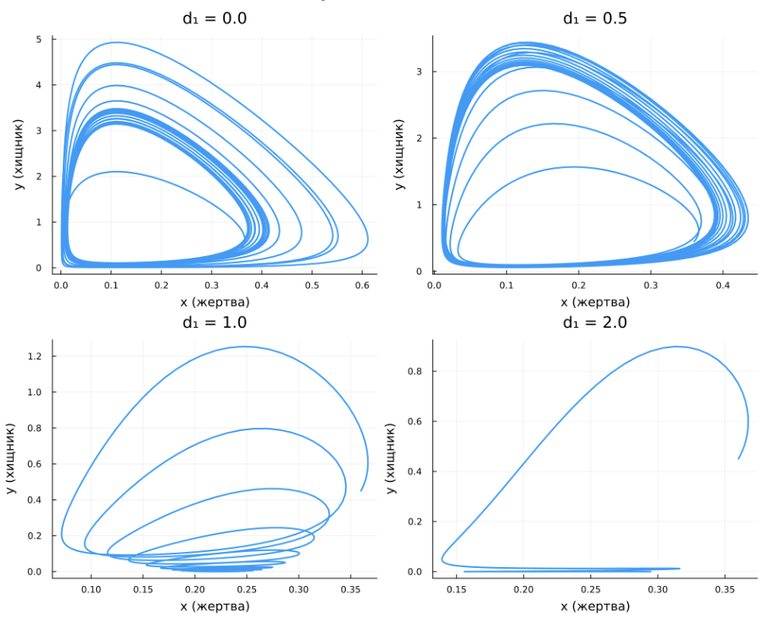

Анализ фазовых портретов при разной интенсивности давления суперхищника:

- $d_1 = 0.0$: траектория делает много витков, спираль растянута — сильные колебания, медленное затухание
- $d_1 = 0.5$: количество витков уменьшается, спираль становится более компактной
- $d_1 = 1.0$: всего 2-3 витка, траектория быстро сходится к равновесию
- $d_1 = 2.0$: практически прямая линия к равновесию, колебания почти отсутствуют

Увеличение $d_1$ оказывает сильное стабилизирующее влияние. Когда суперхищник интенсивно давит на популяцию хищников, колебания последних подавляются, а выход системы на равновесие ускоряется.

## Стохастическая имитационная модель

Реальные экосистемы никогда не бывают полностью детерминированными. На них всегда влияют случайные факторы: погодные аномалии, случайные колебания рождаемости и смертности, генетический дрейф. Чтобы оценить, насколько эти факторы могут изменить поведение системы, была построена стохастическая имитационная модель.

В стохастической модели к правым частям уравнений добавляется случайная составляющая (шум), интенсивность которой зависит от эффективного размера популяции $N$. Чем больше $N$, тем меньше относительная роль случайности, и стохастическая модель приближается к детерминированному пределу.

Численное решение стохастической системы выполнялось методом Эйлера–Маруямы, который является стандартным инструментом для моделирования стохастических дифференциальных уравнений. Схема метода имеет вид:

$$
u(t+dt) = u(t) + f(u)\,dt + \sigma(u)\,\xi\sqrt{dt}
$$

где $f(u)$ — детерминированная часть (правые части системы), $\sigma(u)$ — интенсивность шума, а $\xi$ — случайная величина, распределённая по стандартному нормальному закону $N(0,1)$.

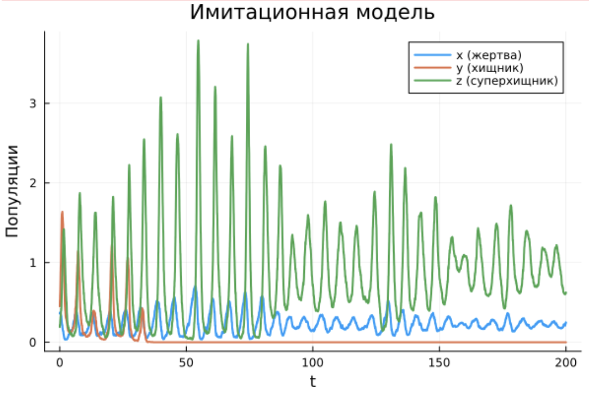

На рисунке видно, как случайный шум сказывается на поведении системы. Траектории не сглажены, как в детерминированном случае, а содержат мелкие нерегулярные выбросы. При этом каждая из трёх показанных реализаций остаётся вблизи того же равновесного состояния, к которому приходит детерминированная модель. Разброс между реализациями заметен, но не настолько велик, чтобы качественно изменить динамику. Для более систематического сопоставления с детерминированным случаем построен график, объединяющий оба подхода.

### Сравнение детерминированной и стохастической моделей

Для наглядного сравнения построим общий график:

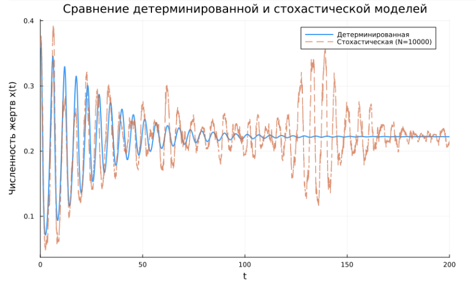

Сравнительный анализ:

| Характеристика | Детерминированная модель | Стохастическая модель ($N=10000$) |
|----------------|-------------------------|----------------------------------|
| Средняя траектория | Гладкая кривая | Колеблется вокруг детерминированной |
| Конечное состояние | Устойчивое равновесие | Флуктуации вокруг равновесия |
| Амплитуда колебаний | Затухает до нуля | Не затухает полностью (остаётся шум) |
| Предсказуемость | Полная | Вероятностная |

Выводы из стохастического моделирования:

1. Сохранение среднего поведения: в среднем стохастическая система сохраняет те же свойства, что и детерминированная. Популяции по-прежнему стремятся к тому же равновесному состоянию, и характер переходных процессов остаётся тем же.

2. Флуктуации: траектории становятся менее гладкими. На графиках появляются мелкие случайные колебания, наложенные на основную динамику. Особенно заметны эти флуктуации в начале процесса, когда система ещё далека от равновесия и градиенты велики.

3. Разброс траекторий: случайные отклонения могут приводить к тому, что система достигает равновесия несколько иным путём, чем в детерминированном случае. Однако конечное состояние (область вблизи равновесной точки) остаётся тем же.

4. Сходимость: при увеличении параметра $N$ (что соответствует росту эффективного размера популяции) влияние случайности уменьшается, и стохастические траектории всё ближе примыкают к детерминированной.

5. Практический вывод: детерминированная модель является хорошим приближением для достаточно больших популяций. Это повышает доверие к детерминированной модели как инструменту анализа.

## Сводная таблица результатов

| Параметр | Значение | Эффект на динамику | Сравнительная оценка |
|----------|----------|-------------------|---------------------|
| $b_1$ (насыщение) | 0.5 (малое) | Сильные колебания, медленное затухание | Дестабилизация |
| | 5.0 (большое) | Слабые колебания, быстрое затухание | Стабилизация |
| $\mu_1$ (смертность хищников) | 0.5 (малая) | Много витков, медленное затухание | Дестабилизация |
| | 2.0 (большая) | Мало витков, быстрое затухание | Стабилизация |
| $\mu_2$ (смертность суперхищников) | 0.5 (малая) | Суперхищник доминирует, рост жертв | Косвенная стабилизация жертв |
| | 4.0 (большая) | Суперхищник слаб, двухвидовая динамика | Дестабилизация (возврат к двухвидовой) |
| $d_1$ (давление на хищников) | 0.0 (нет) | Сильные колебания хищников | Дестабилизация |
| | 3.0 (сильное) | Хищники подавлены, быстрая стабилизация | Стабилизация |
| Суперхищник | Присутствует | Меньшая амплитуда, быстрее затухание | Стабилизация |
| | Отсутствует | Большая амплитуда, медленнее затухание | Дестабилизация |
| Стохастика | $N = 10000$ | Малые флуктуации вокруг детерминированной траектории | Не меняет качественной картины |
| | $N \to 0$ | Сильные флуктуации, возможны случайные вымирания | Качественное изменение |

## Выводы по главе

По итогам численного моделирования выявлено следующее.

1. Устойчивость системы. При фиксированных в расчётах параметрах динамика выходит на стационарное состояние через затухающие колебания. Фазовые портреты идентифицируют это равновесие как устойчивый фокус.

2. Влияние насыщения ($b_1$). Рост параметра насыщения снижает амплитуду колебаний и сокращает время перехода к равновесию — то есть действует как стабилизатор. При больших значениях $b_1$ хищник не способен наращивать потребление без ограничений, и резкие флуктуации подавляются.

3. Влияние смертности ($\mu_1$, $\mu_2$). От коэффициентов смертности хищника и суперхищника зависит очень многое. Низкая смертность раскачивает систему (колебания становятся сильнее), высокая — наоборот, гасит их. Кроме того, смертность суперхищника определяет его роль в системе: если она велика, суперхищник почти исчезает, и модель фактически превращается в двухвидовую.

4. Давление суперхищника ($d_1$). Этот параметр напрямую регулирует численность хищника. Чем интенсивнее суперхищник охотится на хищника, тем быстрее затухают колебания и тем ниже устанавливается равновесная численность хищника.

5. Роль суперхищника в целом. Присутствие верхнего трофического уровня приглушает колебания и ускоряет их затухание. Данный результат согласуется с известным положением: введение третьего звена в трофическую цепь способно стабилизировать динамику.

6. Стохастические эффекты. При достаточно большой численности популяции ($N = 10000$) стохастическая версия модели ведёт себя так же, как детерминированная, — разница лишь в меньшей гладкости траекторий. Когда $N$ уменьшается, случайные факторы начинают играть бо́льшую роль, и в некоторых случаях возможны качественные сдвиги в динамике.

7. Практическая значимость. Полученные зависимости дают основу для оценки того, как реальные трёхпопуляционные системы будут реагировать на изменения ключевых параметров (смертность, насыщение, сила взаимодействия между видами). Такая информация полезна для анализа устойчивости экосистем и для прогноза последствий антропогенных воздействий.